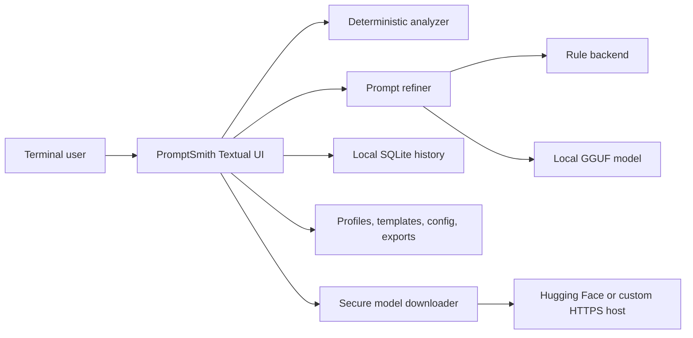

# Architecture: PromptSmith-cli

**Last reviewed:** 2026-07-23  
**Applies to version:** v1 release candidate on `main`

## Purpose and scope

PromptSmith-cli is a local-first terminal application that evaluates prompt quality and optionally refines prompts through deterministic rules, a local small language model (SLM), or a Hybrid chain.

The system owns prompt analysis, profile and template application, local model selection and execution, secure model acquisition, history persistence, export, and the Textual terminal interface. It does not host models as a network service, call cloud inference APIs, or manage prompts across multiple users.

## System context

The terminal user and local filesystem are trusted within the current operating-system account. Model hosts are untrusted network inputs. Downloaded preset files are verified before promotion; custom models receive format validation and optional checksum validation but remain user-supplied code/data inputs to llama.cpp.

## Components

### Textual application

**Responsibility:** Main interaction, screens, keyboard actions, background work, status reporting, and lifecycle coordination  
**Inputs:** Keyboard, mouse, profile/template selections, local files  
**Outputs:** Analysis, refined prompts, status messages, exports  
**State:** Current prompt, analysis, selections, and application-owned managers

The console entry points resolve to `promptsmith.cli.launcher:main`. The launcher supplies the release-candidate bindings and literal analysis hint while extending the main application module.

### Prompt analyzer

**Responsibility:** Deterministic prompt classification, readiness scoring, smell detection, missing-element detection, recommendations, and clarifying challenges  
**Inputs:** Prompt text and optional profile context  
**Outputs:** `PromptAnalysis`  
**State:** None beyond static analysis rules

Analysis occurs without loading a model and behaves consistently across Rule, LLM, and Hybrid profiles.

### Profile and template managers

**Responsibility:** Load, validate, merge, edit, and persist built-in and user-defined YAML  
**Inputs:** Packaged defaults and user-data directories  
**Outputs:** Validated profile/template configurations  
**State:** In-memory indexes backed by YAML files

User entries override same-named built-ins. Edits target user space and survive upgrades.

### Prompt refiner

**Responsibility:** Expand templates, resolve profiles, select backends, reuse backend instances, apply fallback, and record actual backend/model usage  
**Inputs:** Prompt, profile name, optional template name  
**Outputs:** Refined prompt and execution metadata  
**State:** Cached backend instances

Backend reuse avoids repeatedly loading multi-gigabyte models. Cached LLM backends refresh their configured model path before use, unload the previous model when the path changes, and load the newly selected model within the same session.

### Rule backend

**Responsibility:** Deterministic refinement and preservation of profile constraints  
**Inputs:** Prompt and normalized profile  
**Outputs:** Complete rule-refined prompt  
**State:** None

### LLM backend

**Responsibility:** Load one local GGUF model through `llama-cpp-python`, format chat messages, generate a rewrite, clean model-specific preamble/reasoning artifacts, and release native resources  
**Inputs:** Prompt, profile, configured model path  
**Outputs:** Refined prompt or a recoverable failure  
**State:** Loaded llama.cpp model and active model path

Unmatched reasoning markers are removed conservatively rather than causing the entire answer to be discarded. Complete `<think>...</think>` blocks are removed before returning user-visible output.

### Hybrid backend

**Responsibility:** Run deterministic rules first, then request local-model polishing  
**Inputs:** Prompt and profile  
**Outputs:** Polished prompt or the original rule result  
**State:** Rule and LLM backend instances

Hybrid is designed to fail open to the deterministic result when model loading, inference, cleanup, or output-quality checks fail.

### Model downloader

**Responsibility:** Download preset and custom GGUF files safely  
**Inputs:** Catalog entry or custom HTTPS URL  
**Outputs:** Validated GGUF in the model directory  
**State:** Temporary `.part` file during transfer

The downloader validates HTTPS URLs and redirects, rejects unsafe filenames and symlinks, streams data, retries transient failures, validates the GGUF header, verifies known preset SHA-256 values, flushes data, and atomically promotes the completed file.

### History store

**Responsibility:** Persist successful prompt refinements and export history  
**Inputs:** Prompt, refined output, profile, template, backend/model metadata, serialized analysis  
**Outputs:** History rows, JSON export, CSV export  
**State:** SQLite database

The store uses WAL mode, busy timeout, corruption quarantine, and best-effort recovery. History failure must not prevent the rest of PromptSmith from operating.

## Primary lifecycle

1. The user enters a prompt.
2. `PromptAnalyzer` performs deterministic analysis.
3. The user selects or accepts a profile and optional template.
4. `PromptRefiner` loads the profile and expands the template.
5. The refiner resolves or reuses the selected backend.
6. LLM-capable backends refresh the configured model path before use.
7. The backend produces a result or falls back to deterministic rules.
8. The result is checked for basic completeness.
9. Successful refinement metadata is written to SQLite.
10. The UI displays, copies, or exports the result.

## Configuration

Configuration sources are:

1. Code defaults
2. `config.yaml`
3. Built-in profile/template YAML
4. User profile/template overrides
5. Runtime Settings selections persisted through `ConfigManager`

Important values include `default_profile`, `default_template`, and `llm.model_path`.

Model selection is runtime-sensitive. Changing `llm.model_path` must affect cached LLM and Hybrid backends before the next refinement without restarting the process.

## State and data flow

| State | Location | Contents | Retention |
|---|---|---|---|
| Configuration | `config.yaml` under project/user root | Defaults and selected model path | Until edited or removed |
| User profiles | `~/.promptsmith/profiles/` | YAML profile overrides/additions | Until removed |
| User templates | `~/.promptsmith/templates/` | YAML template overrides/additions | Until removed |
| Models | `models/` under resolved project root | GGUF files | Until removed |
| History | `~/.promptsmith/history.db` or portable `user_data/history.db` | Full prompt/output text and metadata | No automatic expiry |
| Logs | PromptSmith user-data directory | Operational events and error classes | External/manual retention |
| Exports | `exports/` | Session markdown and history JSON/CSV | Until removed |

Prompt and refined-output contents are sensitive local data. They belong in history and explicit exports, not logs.

## Security model

- **Trust boundaries:** Terminal user and local account are trusted; downloaded files and remote redirects are untrusted.
- **Secrets:** PromptSmith requires no API keys or account credentials for normal operation.
- **Privileges:** Run as a normal user. Root or administrator privileges are not required.
- **Network exposure:** The application opens no listening ports. Outbound HTTPS is used for dependency and model downloads.
- **Sensitive logs:** Prompt text, refined output, history contents, credentials embedded in prompts, and downloaded response bodies must not be logged.

See [SECURITY.md](SECURITY.md).

## Invariants

- Deterministic analysis must not require or invoke a model.
- Rule refinement must remain available when model operations fail.
- Hybrid must preserve a usable deterministic result when LLM polish fails.
- User profile/template edits must not modify packaged built-ins.
- Model downloads must never write outside the configured model directory.
- Partial or invalid model files must never replace a valid final model.
- Runtime model changes must invalidate the active LLM model before the next inference.
- Prompt and output bodies must not appear in logs.
- History corruption must not prevent application startup.
- Backend instances must be unloaded exactly once during replacement or shutdown.

## Failure and recovery

| Failure | Behavior | Detection | Recovery |
|---|---|---|---|
| Missing or invalid model | LLM returns unavailable; Hybrid falls back to rules | Status bar and log event | Download/select a valid GGUF and retry |
| Model switch during session | Cached backend unloads old model and updates its path | Model Status and next refinement metadata | Re-select model if path is invalid |
| Model out of memory | Model is unloaded and refinement falls back | User-facing warning and error class in logs | Close applications or select a smaller model |
| Malformed model response | Cleanup preserves usable text where possible; Hybrid falls back | Backend warning | Retry or use Hybrid/Rule |
| Interrupted download | `.part` file is removed; valid final file remains unchanged | Status error | Retry download |
| Checksum or GGUF failure | Download is rejected before promotion | Status error | Verify source/catalog and retry |
| SQLite corruption | Database is quarantined and a usable store is recreated when possible | Log and empty/recovered history | Restore backup or inspect quarantined file |
| Invalid profile/template | Validation rejects the change and keeps prior valid state | Editor status | Correct YAML/form values and save again |

## Source map

| Path | Responsibility |
|---|---|
| `src/promptsmith/cli/launcher.py` | Console entry point, release bindings, literal startup hint |
| `src/promptsmith/cli/app.py` | Textual application, screens, history UI, Settings and model switching |
| `src/promptsmith/core/prompt_analyzer.py` | Deterministic analysis and readiness |
| `src/promptsmith/core/refiner.py` | Profile/template/backend orchestration and backend cache |
| `src/promptsmith/core/backends/` | Rule, LLM, and Hybrid implementations |
| `src/promptsmith/core/history.py` | SQLite persistence, recovery, and export |
| `src/promptsmith/core/profiles.py` | Profile loading and validation |
| `src/promptsmith/core/templates.py` | Template loading and validation |
| `src/promptsmith/scripts/package_models.py` | Secure streamed model downloads |
| `src/promptsmith/scripts/model_catalog.py` | Built-in model identities and checksums |
| `src/promptsmith/utils/path_utils.py` | Source, wheel, and portable path resolution |
| `src/promptsmith/data/` | Packaged profiles and templates |
| `src/tests/` | Regression and release-candidate tests |
| `tools/validate_release.py` | Reproducible release validation gate |

## Dependencies

| Dependency | Why it exists | Replacement cost/risk |
|---|---|---|
| Textual | Terminal UI and widget lifecycle | High; UI rewrite |
| llama-cpp-python | Local GGUF inference | High; backend/runtime replacement |
| PyYAML | Profile, template, and configuration files | Medium; format migration |
| requests | Secure streamed custom/preset downloads | Low to medium |
| pyperclip | Clipboard integration | Low; optional platform adapters |
| psutil | System/resource inspection | Low |
| SQLite | Local prompt history | Medium; schema/storage migration |

## Decisions

- [0001 — Backend lifecycle and orchestration](docs/adr/0001-backend-lifecycle-and-orchestration.md)

## Change guide

- To change keyboard behavior or screens, start in `src/promptsmith/cli/launcher.py` and `src/promptsmith/cli/app.py`; preserve terminal-width and focus behavior.
- To change analysis scoring, start in `src/promptsmith/core/prompt_analyzer.py`; preserve deterministic operation.
- To add a backend, implement the backend interface, register it through `BackendRegistry`, add lifecycle tests, and document fallback behavior.
- To change model acquisition, start in `package_models.py` and `model_catalog.py`; preserve confinement, checksum, cleanup, and atomic-promotion invariants.
- To change model selection, preserve runtime refresh for cached LLM and Hybrid instances.
- To change history, update schema/recovery/export tests and document retention or migration effects.